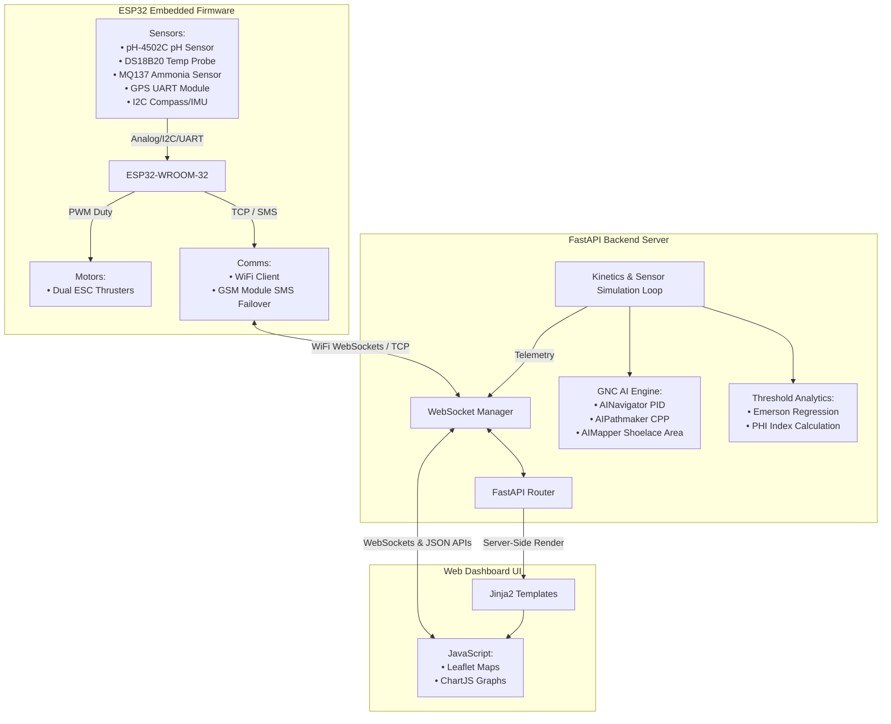

# CERES — Autonomous Aquaculture Monitoring Platform

[](CeresLinux/hardware/src/config.h)
[](CeresLinux/backend)
[](CeresLinux/hardware)
[](README.md)

> [!WARNING]
> **Data Simulation Disclaimer:** This repository is configured for demonstration purposes. All data, telemetry, and metrics displayed in the frontend are simulated for display only and are not intended for significant or production use. The backend processing and actual data pipelines have been decoupled for this public release.

**CERES** is a state-of-the-art, end-to-end autonomous marine vessel system designed for real-time water quality monitoring and intelligence in aquaculture ponds. Specifically optimized for **Nile Tilapia (*Oreochromis niloticus*)** cultivation, the system integrates edge embedded firmware (ESP32), closed-loop GNC (Guidance, Navigation, and Control), and a robust web dashboard with AI coverage path planning.

---

## Author & Agency Recognition

**Lead Developer:** Edgar Joerenz B. Pondales - Robotics Engineering
**Lead Researcher:** Jhairra Vel J. Lopez - Science, Technology, and Engineering

**Recognized by Agencies:**
- Department of Science and Technology (DOST)
- Department of Agriculture (DA)
- Bureau of Fisheries and Aquatic Resources (BFAR)
- Philippine Space Agency (PhilSA)

---

## Architecture Overview



---

## Key Features

1. **Guidance, Navigation, and Control (GNC) Core**:
   - Closed-loop PID control dynamically adjusts differential thrust to steer the vessel to target coordinates.
   - Real-time geographical bearing and distance calculations using Haversine formulations.
   
2. **Coverage Path Planning (CPP) & Autopilot**:
   - Generates four distinct autonomous path strategies for optimal water coverage:
     - **Lawnmower (Boustrophedon Sweep)**: Systematic parallel tracks.
     - **Inward Spiral**: Concentric routes converging toward the pond centroid.
     - **Perimeter Patrol**: Outline trace with configurable boundary insets.
     - **Exploratory Random**: Pseudo-random sampling for rapid environmental profiling.
   - Interactive drawing controls directly on maps to update geo-fenced boundaries.

3. **Aquaculture Threshold Analytics**:
   - Estimates toxic **un-ionized ammonia ($NH_3$)** from Total Ammonia Nitrogen (TAN), temperature, and pH using the **Emerson regression equation**:
     $$pK_a = \frac{2729.92}{T_{\text{Kelvin}}} + 0.09018$$
     $$f = \frac{1}{10^{pK_a - \text{pH}} + 1}$$
     $$NH_3 = \text{TAN} \times f$$
   - Computes the **Pond Habitability Index (PHI)**, a weighted score ($0\%\text{--}100\%$) indicating habitat safety (Optimal, Harmful, Deadly) customized for Tilapia.
   - Predicts **7-day survival rates** based on current parameters and rate-of-change trend penalties.

4. **Resilient Dual-Channel Comms Failover**:
   - Primary: High-throughput **Wi-Fi WebSockets** connection to the dashboard server.
   - Fallback: Automatic fallback to **GSM SMS alerts** sending critical water quality coordinates/parameters when Wi-Fi connection drops.

5. **Secure Access & User Management**:
   - Built-in authentication system with secure login portals.
   - User database for managing roles and access to critical telemetry and control features.

6. **Desktop Kiosk Launcher & Boot Chimes (Windows)**:
   - Full-screen kiosk deployment using a silent VBS launcher script and automatic background process monitor.
   - Cinematic CRT-style HTML boot sequence featuring a live system check log and real-time synthesized audio using the **Web Audio API** (no external audio assets required).

7. **Unified UI & Theme Persistence**:
   - Zero-flash light/dark theme transitions utilizing a synchronous inline anti-flash guard script in the document `<head>`.
   - Redesigned, spacious telemetry console with clean layouts, side-by-side gauges, and a high-density GNC navigation HUD.

---

## Repository Structure

The Ceres repository is a unified, cross-platform project structure tailored for both Windows and Linux hosts:

```text
Ceres/
├── backend/                 # FastAPI backend & telemetry simulation
│   ├── ai_engine.py             # GNC controllers, path-planning & NMEA parser
│   ├── app.py                   # FastAPI application & real-time simulation thread
│   ├── test_system.py           # Automated unit tests for backend logic
│   ├── threshold_analytics.py   # Biology models and water quality threshold indices
│   └── users.json               # Local user database for authentication
├── frontend/                # Jinja2 templates & static web assets (CSS/JS)
│   ├── static/
│   │   ├── css/                 # Dashboard custom stylesheets
│   │   └── js/
│   │       ├── main.js          # Telemetry dashboard updates, charts & REST requests
│   │       └── map.js           # Leaflet map drawing, waypoint management & paths
│   └── templates/
│       ├── about.html           # Project information & credits
│       ├── base.html            # Sidebar navigation shell template
│       ├── calibrate.html       # Sensor calibration interface
│       ├── dashboard.html       # Live monitoring view
│       ├── data.html            # Historical data and analytics view
│       ├── devices.html         # Fleet management and device configuration
│       ├── login.html           # Authentication and login portal
│       └── settings.html        # Application settings
├── hardware/                # ESP32 firmware source code
│   └── src/
│       ├── config.h             # Pin assignments, server details & WiFi configuration
│       └── main.cpp             # Embedded C++ firmware
├── launcher/                # Windows kiosk launcher utilities
│   ├── boot.html                # Retro-style boot splash screen with Web Audio API SFX
│   ├── ceres_icon.png           # Custom Ceres logo image
│   ├── ceres_icon.ico           # Compiled multi-size Windows icon file
│   ├── create_shortcut.ps1      # PowerShell script to create Desktop shortcut & rebuild cache
│   ├── launch_ceres.vbs         # Script to run server silently and open Edge kiosk window
│   ├── start_server.bat         # Batch script to boot the Python backend
│   └── monitor_shutdown.ps1     # Process monitor to clean up background servers on close
├── screenshots/             # Interface and dashboard screenshots
├── requirements.txt         # Backend dependencies list
├── run.sh                   # Launcher script for Linux/macOS
├── run.bat                  # Launcher script for Windows Command Prompt
├── run.ps1                  # Launcher script for Windows PowerShell
└── README.md                # Root documentation (this file)
```

The system components are laid out as follows:
- **`backend/`**: FastAPI application handling REST/WebSocket APIs, kinetics, sensor simulation loops, GNC PID control, and threshold analytics.
- **`frontend/`**: Live telemetry dashboard templates, mapping interface, device management, and sensor calibration screens.
- **`hardware/`**: ESP32 C++ firmware including multi-sensor telemetry collection and failover alert logic.

---

## Setup & Installation

### 1. Web Dashboard Backend

The server is built on **FastAPI** and runs on Python 3.

#### Step 1: Open the Repository Root Directory
The dashboard launches directly from the root workspace directory.

#### Step 2: Install Python Dependencies
Create and activate a virtual environment, then install requirements:

**On Linux/macOS:**
```bash
python3 -m venv venv
source venv/bin/activate
pip install -r requirements.txt
```

**On Windows:**
```cmd
python -m venv venv
venv\Scripts\activate
pip install -r requirements.txt
```

#### Step 3: Running the Dashboard
Use the launcher script corresponding to your operating system:

**On Linux/macOS:**
```bash
./run.sh
```

**On Windows (Command Prompt):**
```cmd
run.bat
```

**On Windows (PowerShell):**
```powershell
.\run.ps1
```

This runs the FastAPI app on `http://localhost:5002`. Open this address in your web browser.

---

### 2. ESP32 Embedded Firmware

The firmware compiles via **Arduino IDE** or **PlatformIO** targeting an **ESP32-WROOM-32**.

#### Required Arduino Libraries
Ensure the following libraries are installed in your build tool:
- `WiFi.h` (Built-in ESP32)
- `WebSocketsClient` (Markus Sattler)
- `OneWire` (Paul Stoffregen)
- `DallasTemperature` (Miles Burton)

#### ESP32 Wiring Diagram / Pinout
Modify your wiring or compile-time assignments in `hardware/src/config.h`:

| Sensor/Actuator | Pin (ESP32 GPIO) | Protocol / Interface | Notes |
| :--- | :---: | :---: | :--- |
| **pH-4502C Sensor** | `34` | Analog Input | Voltage mapping for pH levels |
| **DS18B20 Temp Probe** | `4` | 1-Wire Bus | Waterproof temperature probe |
| **MQ137 Ammonia** | `36` (ADC) / `39` (D) | Analog & Digital Input | Detects $NH_3$ concentrations |
| **GPS Module** | `16` (RX2) / `17` (TX2) | UART (UART2) @ 9600 bps | For localization |
| **GSM Module** | `26` (RX1) / `27` (TX1) | UART (UART1) @ 115200 bps| SMS failover alerts |
| **Compass & IMU** | `21` (SDA) / `22` (SCL) | I2C Bus | Shared QMC5883L / MPU-6050 |
| **Left Propeller ESC** | `25` | PWM Output (LEDC channel 0)| 50Hz, 16-bit resolution |
| **Right Propeller ESC** | `14` | PWM Output (LEDC channel 1)| 50Hz, 16-bit resolution |
| **Status LED** | `2` | Digital Output | Solid: WiFi Connected |
| **Alert LED** | `13` | Digital Output | Solid: Comms Fallback active |

#### Firmware Configuration (`config.h`)
Before flashing your ESP32, update the Wi-Fi credentials and server endpoint inside `hardware/src/config.h`:
```cpp
#define WIFI_SSID             "YourWifiSSID"
#define WIFI_PASSWORD         "YourWifiPassword"
#define SERVER_HOST           "192.168.1.XX"  // IP address of your FastAPI server
#define SERVER_PORT           5002
#define SMS_ALERT_NUMBER      "+639XXXXXXXXX" // Alert SMS destination
```

---

### 3. Windows Desktop Kiosk Launcher

You can install a native Windows desktop shortcut that launches the backend server silently in the background and opens the dashboard in a maximized, fullscreen kiosk window with retro CRT boot animations and sound effects.

#### Step 1: Set Up Python Virtual Environment
Ensure you have completed **Step 2** of the **Web Dashboard Backend** installation above so the local environment exists.

#### Step 2: Build the Shortcut Icon & Register
Open a PowerShell terminal as Administrator, navigate to the repository root, and run:
```powershell
powershell .\launcher\create_shortcut.ps1
```
This script will:
1. Compile the high-resolution `ceres_icon.png` into a multi-resolution Windows `ceres_icon.ico` file using the Pillow library in your virtual environment.
2. Create `CERES.lnk` shortcuts on your **Desktop** and in the **Project Root**.
3. Rebuild the Windows system icon cache to ensure the custom logo displays correctly.

#### Step 3: Run the System
Simply double-click the **CERES** shortcut on your Desktop! It will:
- Spin up the Python backend server invisibly in the background.
- Open Microsoft Edge in kiosk mode, loading `launcher/boot.html` with systems initialization checks and synthesized boot audio.
- Redirect to the telemetry console on `http://localhost:5002` and automatically transition to fullscreen (`F11`).
- Monitor window activity and automatically close the backend server when the Edge window is closed.

---

## Verification & Testing

To test the GNC algorithms, PID calculations, NMEA sentence parsing, and Pond Wellness scoring modules offline, execute the automated unit test suite from the repository root:

**On Linux/macOS:**
```bash
venv/bin/python backend/test_system.py
```

**On Windows:**
```cmd
venv\Scripts\python backend/test_system.py
```

Expected output:
```text
Testing NMEA parsing...
✓ NMEA parsing tests passed!
Testing Nile Tilapia threshold analytics...
Calculated un-ionized ammonia: 0.1118 mg/L
✓ Tilapia wellness tests passed!
Testing PID controller and steering calculations...
✓ PID steering tests passed!

All automated tests completed successfully!
```
